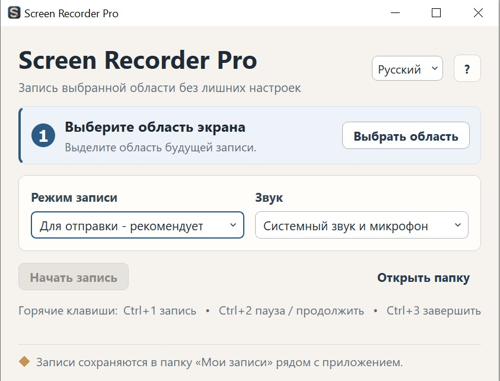

# Screen Recorder Pro

Windows-приложение для записи выбранной области экрана в MP4/H.264 с системным
звуком, микрофоном, курсором и отображением кликов.



## Задача проекта

Приложение создавалось для быстрой подготовки видеофиксаций ошибок
и пользовательских сценариев на Windows.

Требовалось записывать выбранную область экрана, отображать курсор
и клики, захватывать системный звук и микрофон, а результат сохранять
в распространённом формате MP4/H.264.

Итоговое видео должно было без дополнительной конвертации
прикрепляться к задачам и воспроизводиться в Яндекс Трекере.

## Моя роль

В рамках проекта я:

- сформулировал пользовательскую задачу и требования к записи;
- определил основные сценарии, режимы качества и источники звука;
- задал требования к совместимости итогового видео;
- организовал AI-assisted разработку приложения;
- собирал и запускал версии в PyCharm;
- проверял запись экрана, звука, курсора и горячих клавиш;
- анализировал ошибки и уточнял требования по результатам тестирования;
- подготовил переносимую сборку для Windows.

Код создавался с активным использованием AI-инструментов.
Моя зона ответственности — постановка задачи, требования,
проверка поведения, диагностика проблем и приёмка результата.

## Возможности

- выбор произвольной области одного или нескольких экранов;
- запись MP4/H.264 с фиксированными режимами частоты кадров;
- захват без звука, системного звука, микрофона или двух источников одновременно;
- отображение курсора и визуальная индикация кликов;
- пауза и продолжение записи;
- глобальные горячие клавиши;
- сохранение записей в папку `Мои записи` рядом с приложением;
- переносимая onefile-сборка с включённым `ffmpeg.exe`.

## Статус проекта

Рабочая версия регулярно используется для подготовки видеофиксаций
ошибок и пользовательских сценариев на Windows.

С помощью приложения подготовлено около 40 записей, совместимых
с Яндекс Трекером. Видео сохраняется в MP4/H.264 и корректно
воспроизводится после прикрепления к задаче.

Реализованы запись выбранной области, системный звук и микрофон,
визуализация курсора и кликов, пауза и глобальные горячие клавиши.

Готовая onefile-сборка включает FFmpeg и не требует отдельной
установки Python.

## Системные требования

- Windows 10 или Windows 11;
- Python 3.10 для запуска из исходников и разработки;
- FFmpeg в `PATH` для запуска из исходников и создания сборки.

Готовая onefile-сборка включает `ffmpeg.exe` и не требует отдельной установки
Python или FFmpeg.

## Установка

```powershell
py -3.10 -m venv .venv
.\.venv\Scripts\Activate.ps1
python -m pip install --upgrade pip
python -m pip install -r requirements.txt
```

Для сборки установите инструменты разработки:

```powershell
python -m pip install -r requirements-dev.txt
```

## Запуск из исходников

```powershell
python screen_recorder.py
```

1. Нажмите «Выбрать область» и выделите нужную часть экрана.
2. Выберите режим записи и источник звука.
3. Нажмите «Начать запись».
4. Используйте кнопки приложения или горячие клавиши для паузы и завершения.

## Режимы записи

- `Для отправки — рекомендуется` — 30 FPS;
- `Максимальное качество` — 24 FPS;
- `Компактный размер` — 15 FPS.

## Звук

- `Без звука` — MP4 без аудиодорожки;
- `Звук компьютера` — системный звук Windows;
- `Микрофон` — звук входного устройства;
- `Компьютер + микрофон` — одновременный захват двух источников.

## Горячие клавиши

- `Ctrl+1` — начать запись;
- `Ctrl+2` — пауза или продолжение;
- `Ctrl+3` — завершить запись.

## FFmpeg

При запуске из исходников приложение ищет `ffmpeg.exe` в системном `PATH`.
Актуальный [screen_recorder.spec](screen_recorder.spec) также требует доступный
FFmpeg во время сборки и помещает найденный бинарник внутрь onefile-приложения.
`ffprobe.exe` приложением не используется.

## Тесты

```powershell
python -m unittest discover -s tests -p "test_*.py"
```

## Сборка EXE

```powershell
python -m PyInstaller --noconfirm --clean screen_recorder.spec
```

Результат создаётся в каталоге `dist`. Перед публикацией переименуйте финальный
EXE в уникальное версионное имя и приложите лицензионные файлы из раздела ниже.

## Структура проекта

```text
screen_recorder.py           основное приложение и точка запуска
audio_capture.py             захват и обработка аудио
media_mux.py                 финальная сборка MP4
async_frame_writer.py        асинхронная запись видеокадров
frame_scheduler.py           планирование кадров
region_geometry.py           расчёт геометрии выбранной области
assets/                      иконка приложения и UI-ресурсы
tests/                       автоматические тесты
benchmarks/                  локальные диагностические сценарии
screen_recorder.spec         актуальная конфигурация PyInstaller
requirements.txt             runtime-зависимости
requirements-dev.txt         инструменты сборки
```
